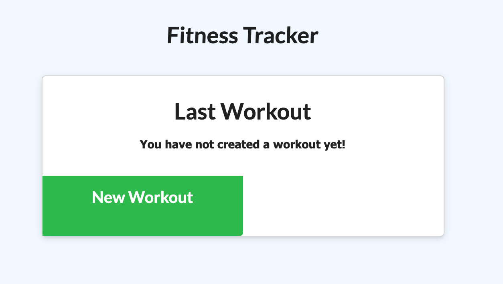
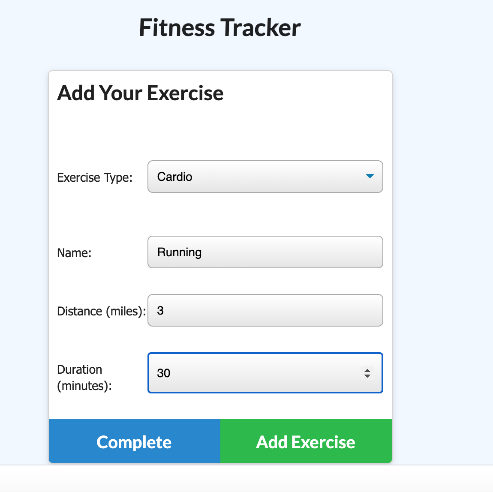
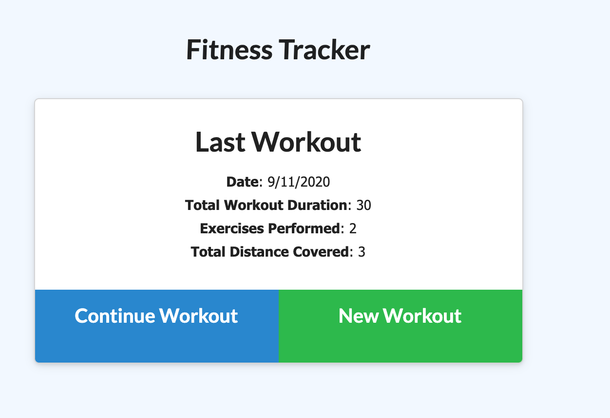
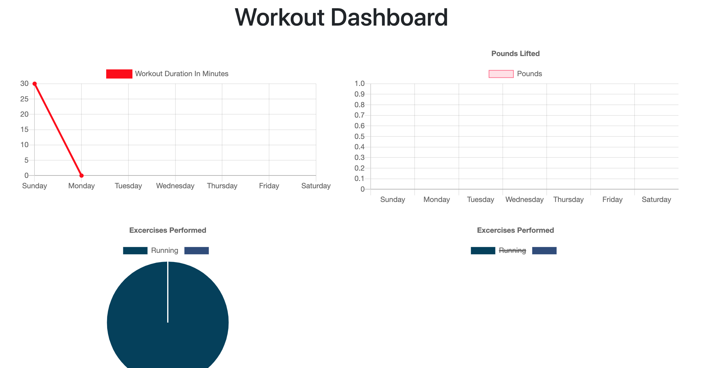

# Fitness Tracker

Created by me: *Danielle Hillman*
Link to repo: https://github.com/daniellehillman/fitnesstracker

## Start

This application allows the user to keep track of their exercises and look back on totals.

### Add Exercise

### Add More

The user can input the exercise type, name of exercise, distance, and duration.

### Devour

After completeing the exercise, the page is taken back to where they can start a new one or continue. The workouts totals are displayed on the screen. 

The dashboard provides a visual pie chart and graphs about the workouts from the user. 

The deployed version found here: 
https://shielded-wave-45538.herokuapp.com/

